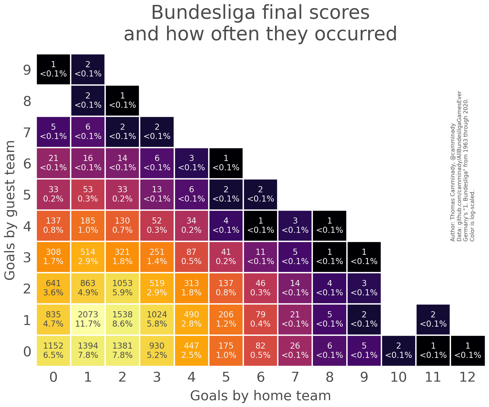

# AllBundesligaGamesEver

This repository contains (i) a file with all Bundesliga (First and Second) games ever played and (ii) a script to reproduce the data.

Additionally, there is legacy code that was initially used for a prior version. That legacy code did not gather data for the Second Bundesliga. However, when the data was initially scraped with that code, it was able to scrape the time of matches as well. This is no longer possible with the current version. (Sidenote: I don't think the problem is the code, but rather changes in the website from which the data is scraped.) As an overview, here is a heatmap of match results of all 1. Bundesliga games ever played.



## Format

Data is stored in a simple, readable CSV file. For every match, we store the following keys:

```
[
 'SeasonFrom',
 'SeasonTo',
 'Matchday',
 'Day',
 'Date',
 'Time',
 'Home',
 'Guest',
 'Score90',
 'Score45',
 'Score90Home',
 'Score90Guest',
 'Score45Home',
 'Score45Guest',
 'PointsHome',
 'PointsGuest',
 'Aborted',
 'Annulled',
 'League',
]
```

The `Time` field is empty but kept for compatibility with the legacy code.


## Issues
Two games are listed as *aborted*. They do have a final score, but no half time score is listed and the games are repeated. I did keep the entries but filled the half time score wit `pd.NA`. The two games can be found [here](https://www.kicker.de/bundesliga/spieltag/2007-08/28/0) and [here](https://www.kicker.de/bundesliga/spieltag/1963-64/14/0) (look for the 'abgr.' (aborted) label). For them, the `Aborted` key is `True`. Additionally, one game was annulated, see [here](https://www.kicker.de/2-bundesliga/spieltag/2003-04/13/0) and the `Annulled` key is set to `True`.

Additionally, no half time score was found for these matches (this table is copied verbatim from the legacy code):
```
1970  ,  1971  ,  27  ,  Saturday  ,  1971-04-03  ,  15:30  ,  Gladbach   ,  Bremen
1976  ,  1977  ,  15  ,  Saturday  ,  1976-11-27  ,  15:30  ,  K'lautern  ,  Düsseldorf 
1992  ,  1993  ,  32  ,  Saturday  ,  1993-05-22  ,  15:30  ,  Uerdingen  ,  Frankfurt  
1994  ,  1995  ,  26  ,  Saturday  ,  1995-04-15  ,  15:30  ,  Frankfurt  ,  Bayern  
```

The number of games between this version and the legacy code does not match exactly, the legacy code has fewer games. At a first glance, it seems like the old code had problems identifying [delayed games](https://www.kicker.de/bundesliga/spieltag/1963-64/25), whereas the new code handles this. I am not entirely sure if this is the reason for the difference and whether it is handled correctly now, but it seems as if the new code does a better job here. 

Lastly, the code is insanely slow and scraping takes forever (about an hour). 
